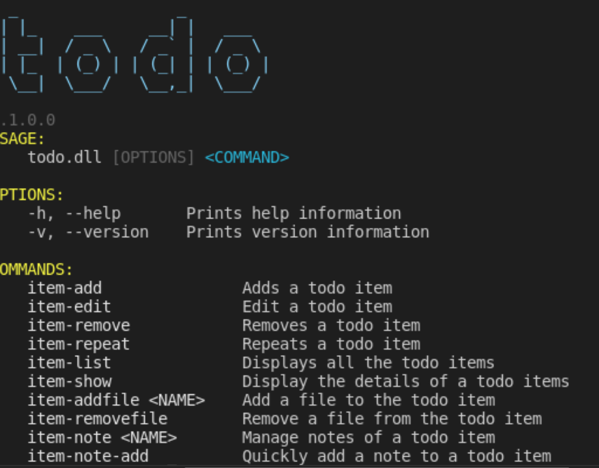

# todo

### About

todo is a CLI application for taking notes. It makes use of [Spectre.Console](https://github.com/spectreconsole/spectre.console)

### Demo

## Add a todo item
    todo item-add "Remember the milk"
    todo ia "Remember the mil"

### Features

### Commands
